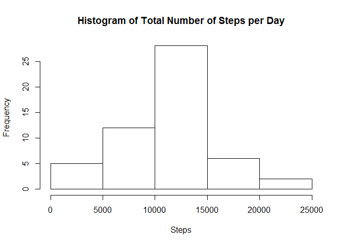
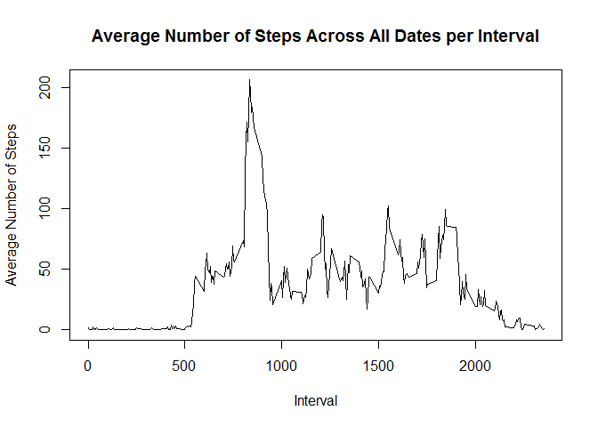
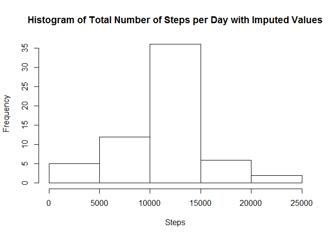
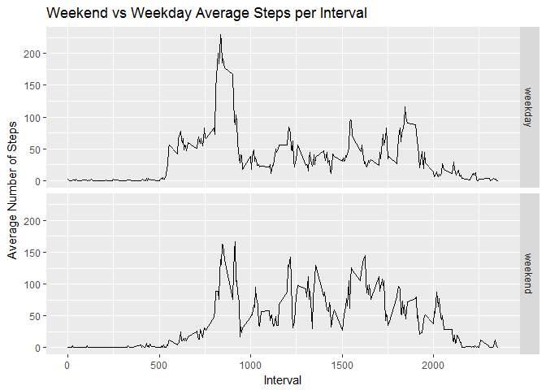

# Reproducible Research: Peer Assessment 1

```
## 
## Attaching package: 'dplyr'
```

```
## The following objects are masked from 'package:stats':
## 
##     filter, lag
```

```
## The following objects are masked from 'package:base':
## 
##     intersect, setdiff, setequal, union
```

## Loading and preprocessing the data

```r
setwd("C:/Users/felipea/Documents/GitHub/RepData_PeerAssessment1")
df <- read.csv("activity.csv", header = TRUE)
df$date <- as.Date(df$date, "%Y-%m-%d")

# Ignore the missing values in the dataset
df2 <- df[!is.na(df$steps),]
summary(df2)
```

```
##      steps             date               interval     
##  Min.   :  0.00   Min.   :2012-10-02   Min.   :   0.0  
##  1st Qu.:  0.00   1st Qu.:2012-10-16   1st Qu.: 588.8  
##  Median :  0.00   Median :2012-10-29   Median :1177.5  
##  Mean   : 37.38   Mean   :2012-10-30   Mean   :1177.5  
##  3rd Qu.: 12.00   3rd Qu.:2012-11-16   3rd Qu.:1766.2  
##  Max.   :806.00   Max.   :2012-11-29   Max.   :2355.0
```


## What is mean total number of steps taken per day?
1. Calculate the total number of steps taken per day
2. Make a histogram of the total number of steps taken each day
3. Calculate and report the mean and median of the total number of steps taken per day

```r
# Compute the total number of steps per day
df2.total <- aggregate(steps ~ date, data=df2, FUN=sum)
head(df2.total)
```

```
##         date steps
## 1 2012-10-02   126
## 2 2012-10-03 11352
## 3 2012-10-04 12116
## 4 2012-10-05 13294
## 5 2012-10-06 15420
## 6 2012-10-07 11015
```

```r
# Display histogram of the total number of steps
hist(df2.total$steps, xlab="Steps", main = "Histogram of Total Number of Steps per Day")
```

<!-- -->

```r
# Show mean and median
mean(df2.total$steps)
```

```
## [1] 10766.19
```

```r
median(df2.total$steps)
```

```
## [1] 10765
```

## What is the average daily activity pattern?
1. Make a time series plot (i.e. type = "l") of the 5-minute interval (x-axis)
  and the average number of steps taken, averaged across all days (y-axis)
2. Which 5-minute interval, on average across all the days in the dataset, 
  contains the maximum number of steps?


```r
# Compute average number of steps per interval
df3 <- df2 %>% group_by(interval) %>% summarize(avg_steps=mean(steps))
str(df3)
```

```
## Classes 'tbl_df', 'tbl' and 'data.frame':	288 obs. of  2 variables:
##  $ interval : int  0 5 10 15 20 25 30 35 40 45 ...
##  $ avg_steps: num  1.717 0.3396 0.1321 0.1509 0.0755 ...
```

```r
# Plot using line chart
plot(x=df3$interval, y=df3$avg_steps, type="l", xlab = "Interval", ylab="Average Number of Steps",
     main = "Average Number of Steps Across All Dates per Interval")
```

<!-- -->

```r
# Show the rowdata containing the maximum number of steps
df3[which.max(df3$avg_steps),]
```

```
## # A tibble: 1 × 2
##   interval avg_steps
##      <int>     <dbl>
## 1      835  206.1698
```

## Imputing missing values
1. Calculate and report the total number of missing values in the dataset (i.e. the total number of rows with NAs)
2. Devise a strategy for filling in all of the missing values in the dataset. The strategy does not need to be sophisticated. For example, you could use the mean/median for that day, or the mean for that 5-minute interval, etc.
3. Create a new dataset that is equal to the original dataset but with the missing data filled in.
4. Make a histogram of the total number of steps taken each day and Calculate and report the mean and median total number of steps taken per day. Do these values differ from the estimates from the first part of the assignment? What is the impact of imputing missing data on the estimates of the total daily number of steps?

```r
# Only steps column contains NAs
summary(df)
```

```
##      steps             date               interval     
##  Min.   :  0.00   Min.   :2012-10-01   Min.   :   0.0  
##  1st Qu.:  0.00   1st Qu.:2012-10-16   1st Qu.: 588.8  
##  Median :  0.00   Median :2012-10-31   Median :1177.5  
##  Mean   : 37.38   Mean   :2012-10-31   Mean   :1177.5  
##  3rd Qu.: 12.00   3rd Qu.:2012-11-15   3rd Qu.:1766.2  
##  Max.   :806.00   Max.   :2012-11-30   Max.   :2355.0  
##  NA's   :2304
```

```r
# Count NA rows in steps column
sum(is.na(df$steps))
```

```
## [1] 2304
```

```r
# Create copy of original dataset
df4 <- df

# Join with data which already contains the average steps per interval
df4.imp <- inner_join(x = df4, y = df3, by="interval") 
summary(df4.imp)
```

```
##      steps             date               interval        avg_steps      
##  Min.   :  0.00   Min.   :2012-10-01   Min.   :   0.0   Min.   :  0.000  
##  1st Qu.:  0.00   1st Qu.:2012-10-16   1st Qu.: 588.8   1st Qu.:  2.486  
##  Median :  0.00   Median :2012-10-31   Median :1177.5   Median : 34.113  
##  Mean   : 37.38   Mean   :2012-10-31   Mean   :1177.5   Mean   : 37.383  
##  3rd Qu.: 12.00   3rd Qu.:2012-11-15   3rd Qu.:1766.2   3rd Qu.: 52.835  
##  Max.   :806.00   Max.   :2012-11-30   Max.   :2355.0   Max.   :206.170  
##  NA's   :2304
```

```r
# Get the mean value for those with null steps
df4.imp[is.na(df4.imp$steps),"steps"] <- df4.imp[is.na(df4.imp$steps),]$avg_steps

# Now there are no NAs
summary(df4.imp)
```

```
##      steps             date               interval        avg_steps      
##  Min.   :  0.00   Min.   :2012-10-01   Min.   :   0.0   Min.   :  0.000  
##  1st Qu.:  0.00   1st Qu.:2012-10-16   1st Qu.: 588.8   1st Qu.:  2.486  
##  Median :  0.00   Median :2012-10-31   Median :1177.5   Median : 34.113  
##  Mean   : 37.38   Mean   :2012-10-31   Mean   :1177.5   Mean   : 37.383  
##  3rd Qu.: 27.00   3rd Qu.:2012-11-15   3rd Qu.:1766.2   3rd Qu.: 52.835  
##  Max.   :806.00   Max.   :2012-11-30   Max.   :2355.0   Max.   :206.170
```

```r
anyNA(df4.imp$steps) #should return FALSE
```

```
## [1] FALSE
```

```r
# Calculate total for the histogram
df4.imp.total <- aggregate(steps ~ date, data=df4.imp, FUN=sum)

# Show histogram
hist(df4.imp.total$steps, xlab="Steps", main = "Histogram of Total Number of Steps per Day with Imputed Values")
```

<!-- -->

```r
# Compute the mean and median
summary(df4.imp.total)
```

```
##       date                steps      
##  Min.   :2012-10-01   Min.   :   41  
##  1st Qu.:2012-10-16   1st Qu.: 9819  
##  Median :2012-10-31   Median :10766  
##  Mean   :2012-10-31   Mean   :10766  
##  3rd Qu.:2012-11-15   3rd Qu.:12811  
##  Max.   :2012-11-30   Max.   :21194
```

```r
mean(df4.imp.total$steps)
```

```
## [1] 10766.19
```

```r
median(df4.imp.total$steps)
```

```
## [1] 10766.19
```

The mean is now equal to the median.

## Are there differences in activity patterns between weekdays and weekends?
1. Create a new factor variable in the dataset with two levels - "weekday" and "weekend" indicating whether a given date is a weekday or weekend day.
2. Make a panel plot containing a time series plot (i.e. type = "l") of the 5-minute interval (x-axis) and the average number of steps taken, averaged across all weekday days or weekend days (y-axis). See the README file in the GitHub repository to see an example of what this plot should look like using simulated data.

```r
df4.imp[weekdays(df4.imp$date, TRUE) %in% c("Sat", "Sun"), "day"] <-  "weekend"
df4.imp[!weekdays(df4.imp$date, TRUE) %in% c("Sat", "Sun"), "day"] <-  "weekday"

df5 <- df4.imp %>% group_by(interval,day) %>% summarize(avg_steps2=mean(steps)) %>% select(interval, avg_steps2, day)

g1 <-  ggplot(df5, aes(interval,avg_steps2)) + geom_line() + ggtitle("Weekend vs Weekday Average Steps per Interval") + labs(x="Interval", y="Average Number of Steps")
g1 + facet_grid( day ~ . ) 
```

<!-- -->

